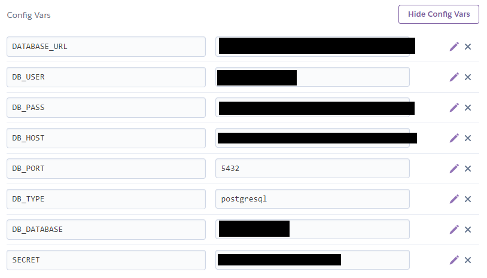

## Notesdemon (ja tietokannan) siirtäminen Herokuun

### Testaus lokaalisti

Tietokanta migrations ja ohjelman toiminta sen kanssa kannattaa ensin testata lokaalin Postgres tietokannan kanssa ennen sen siirtämistä Herokuun.

Jos olet käyttänyt MySQL-tietokantaa tähän asti, siirtyminen Postgres:iin voi vaatia pieniä muutoksia koodiin.

1. Käynnistä lokaali Postgres ja luo sinne tietokanta (notes)

    - [Ohjeet Postgres:in käynnistämiseen ja tietokannan luomiseen](../../docker/postgres-pgadmin4.md)

2. Muuta *knexfile.js* - käyttämään lokaalia Postgres-tietokantaan:

    ```js
    development: {
        client: 'postgresql',
        connection: {
        user:'postgres',
        password: 'mypass123',
        database: 'notes'
        }
    },
    ```

3. Aja migrations

    ```cmd
    npx knex migrate:latest
    npx knex seed:run
    ```

    *Huom!* Jos olet käyttänyt tähän asti vain MySQL-tietokantaa, asenna Postgres ensin (database-kansiossa):

    ```cmd
    npm install pg --save
    ```

4. Testaa ohjelman toiminta lokaalin tietokannan kanssa

    Muokkaa *.env* - tiedostoon lokaalin tietokannan tiedot ja käynnistä se (npm start):

    ```cmd
    PORT=3000
    DB_USER=postgres
    DB_PASS=mypass123
    DB_HOST=localhost
    DB_PORT=5432
    DB_TYPE=postgresql
    DB_DATABASE=notes
    SECRET=tosisalainensalasanainen
    ```

    *Huom!* Jos olet käyttänyt tähän asti vain MySQL-tietokantaa, asenna Postgres ensin (backend-kansiossa):

    ```cmd
    npm install pg --save
    ``` 

5. Tee tarvittavat muutokset koodiin

    MySQL-tietokanta palautta INSERT:issa luotujen tietueiden id:t automaattisesti. Posgres-tietokannan kanssa id:t pitää pyytää erikseen.

    Lisää "returning" knex:iin:

    ```js
    knex('notes').insert(newNote).returning('id') 
    ```

    Tämän lisäksi palautettu id ei ole luku (kuten MySQL:ssä), vaan olio, joten lisää koodiin myös *.id*, jotta saat id:lle lukuarvon:

    ```js
    return_value[0].id
    ```

6. Tietokannan siirtäminen Herokuun

    Siirrä nyt tietokanta Herokuun ([ohjeet Postgres-tietokannan siirtämiseksi Herokuun](knex-migrations.html))

7. Heroku-tietokannan testaaminen

    Testaa ohjelmasi toiminta käyttämällä Heroku:ssa olevaa tietokantaa, muokkaa .env-tiedostoa ja käynnistä ohjelmasi uudelleen.

    ```cmd
    PORT=3000
    DB_USER=your_user_in_heroku
    DB_PASS=your_password_in_heroku
    DB_HOST=your_host_in_heroku
    DB_PORT=5432
    DB_TYPE=postgresql
    DB_DATABASE=your_database_in_heroku
    SECRET=tosisalainensalasanainen
    ```

    *Huom!* Poista SSL-varoitukset lisäämällä tämä rivi utils/config.js -tiedostoon (kohtaan *connection*):

    ```js
           ssl:  { rejectUnauthorized: false }
    ```

8. Docker-kontin luominen

    - Tee nyt ohjelmastasi Docker-kontti ([ohjeet Docker-kontin tekemiseen](../../docker/notesdemofull.html))

9. Ympäristömuuttujien konffaaminen Herokussa

    Lisää tarvittavat ympäristömuuttujat Heroku-appiin (Config Vars):

    

10. Siirrä kontti Herokuun

    - Siirrä kontti Herokuun [ohjeet Docker-kontin siirtämiseksi Herokuun](container-deployment.html)