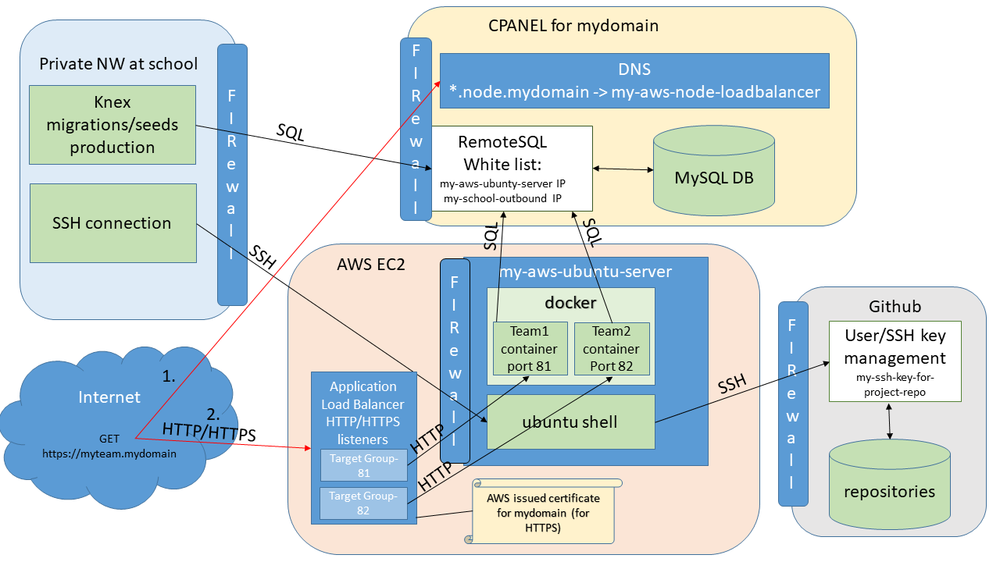

## node.js - ohjelman ajaminen AWS - serverillä

Kaikilla tiimeillä on oma käyttäjä/salasana sekä kotihakemisto yhteisellä Ubuntu - palvelimella. Jokaisella ryhmällä on oma portti, johon käynnistetään projektityön docker-kontti. Koska käytämme yhteistä serveriä, sama docker instanssi ajaa kaikkien ryhmien kontteja, älä koske muoden kontteihin vain omaasi.

### Siirrä tietokantasi tietokantapalvelimelle

1. Luo uusi tietokanta ja käyttäjä CPANEL:iin ja aja sinne migrations ja seeds. Pidä huoli siitä, että AWS serveri saa siihen yhteyden (lisää serveri Remote MySQL white listalle). Ota tietokannan host, DB nimi, käyttäjä ja salasana talteen (.env:iä varten).

### Ota yhteys AWS:n serverille

1. Avaa Bash ja ota [SSH-yhteys](https://www.ssh.com/academy/ssh/protocol) serverille (kysyy salasanan):

    ```cmd 
    > ssh team1@my_ubuntu_ip
    ```

2. Aseta Github SSH key:t projektin koodirepoon [ohjeet](https://www.theserverside.com/blog/Coffee-Talk-Java-News-Stories-and-Opinions/GitHub-SSH-Key-Setup-Config-Ubuntu-Linux)

    ```cmd
    $ ssh-keygen
    $ cd /home/ubuntu/.ssh
    $ cat id_rsa.pub
    $ cd ~
    ```

    Kopioi *public key* hiiren oikealla ja tallenna avain github-projektin koodirepoon (Account Settings -> SSH -> Add key).

3. Kloonaa repo käyttämällä SSH - osoitetta:

    ```cmd
    $ git clone git@github.com:xxx/yyy.git
    ```

4. Luo .env - tiedosto, ja muokkaa ympäristömuuttujat siihen (tietokannan host, DB nimi, käyttäjä ja salasana jne.). Voit luoda tiedoston käyttämällä nanoa (tallennus Ctrl-x + yes):

    ```cmd
    $ cd backend
    $ nano .env 
    ```

5. Buildaa projekti käyttäen ryhmällesi varattua porttia (tässä portti on 81). Lisää kontille myös nimi (--name), jotta kontit eivät mene sekaisin.

Huom! poista .dockerignoresta .env (tässä haluamme sen mukaan).

    ```cmd
    $ docker build . -t myapp
    $ docker run -d --name team1_sprint1 -p 81:3000 myapp
    ```

    Nyt jokaisen ryhmän node.js - applikaatio löytyy oman subdomainin alta esim.

        https://team1.my_domain.yy
        https://team2.my_domain.yy

--- 

### Version päivittäminen serverille

Jatkossa uuden version asentamiseen riittää:

1. Avaa Bash ja ota SSH-yhteys serveriin

2. Tee pull repoon, poista vanha kontti, tee uusi build ja käynnistä se:

    ```cmd
    $ git pull
    $ docker stop team1_app
    $ docker rm team1_app
    $ docker build . -t myapp
    $ docker run -d --name team1_sprint2 -p 81:3000 myapp
    ```

### The big picture

